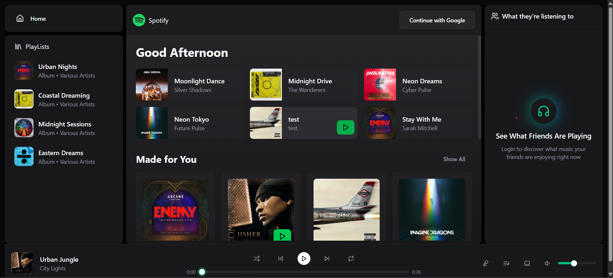
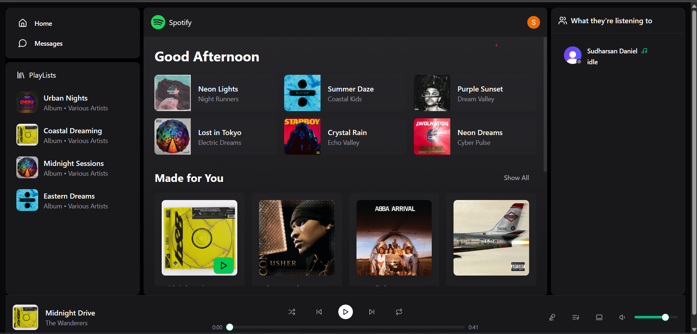

# 🎧 Spotify Clone

A real-time music streaming web application that allows users to stream songs, explore albums, and manage playlists through an intuitive and modern interface.

It includes a built-in music player and an admin dashboard for uploading and managing songs and albums, providing a seamless and engaging listening experience.

---

## Live Link

[Spotify Clone](https://sd-spotify-clone.onrender.com/)

## 📸 Screenshots




## 🚀 Features

### 🎵 Core Functionalities

- 🎧 Play, pause, and skip songs with a modern audio player.
- 💿 Browse albums and view artist details.
- 🔐 Secure authentication using **Clerk**.
- ☁️ Upload songs and album images via **Cloudinary**.
- 📊 Analytics dashboard to view most played songs and active users.
- 🧑‍💻 Admin panel to manage songs, albums, and metadata.
- 💬 Real-time chat and online status tracking.
- 🌙 Responsive and clean UI inspired by Spotify design.

---

## 🧩 Tech Stack

- **Frontend**: React, TypeScript, Tailwind CSS
- **Backend**: Node.js, Express.js
- **Database**: MongoDB with Mongoose
- **Authentication**: Clerk
- **File Storage**: Cloudinary
- **Deployment**: Render

---

## ⚙️ Installation & Setup

### 1. Clone the Repository

```bash
git clone https://github.com/danielace1/spotify-clone.git
cd spotify-clone
```

### 2. Install Dependencies

```bash
cd server && npm install
cd ../client && npm install
```

### 3. Configure Environment Variables

Create a `.env` file in both the `server` and `client` directories with the following variables:

#### Server (.env)

```
PORT=5000
MONGO_URI=<your-mongodb-uri>
CLOUDINARY_CLOUD_NAME=<your-cloudinary-cloud-name>
CLOUDINARY_API_KEY=<your-cloudinary-api-key>
CLOUDINARY_API_SECRET=<your-cloudinary-api-secret>
CLERK_SECRET_KEY=<your-clerk-secret>
```

#### Client (.env)

```
VITE_CLERK_PUBLISHABLE_KEY=<your-clerk-publishable-key>
```

### 4. Run the Application

#### Start the Server

```bash
cd server
npm run dev
```

#### Start the Client

```bash
cd client
npm run dev
```

The application should now be running at `http://localhost:5173`.

## 🧠 API Overview

- /api/auth – Handles user authentication

- /api/users – Fetch user information

- /api/songs – Get or upload songs

- /api/albums – Get or create albums

- /api/admin – Admin actions for uploading media

- /api/stats – Fetch analytics data

## 🤝 Contributing

We welcome contributions to the Spotify Clone project! If you'd like to contribute, please follow these steps:

1. [Fork](https://github.com/danielace1/spotify-clone/fork) the repository.
2. Create a new branch for your feature or bug fix.
3. Make your changes and commit them with descriptive messages.
4. Push your changes to your forked repository.
5. Submit a [pull request](https://github.com/danielace1/spotify-clone/pulls) detailing your changes.

Thank you for your interest in contributing!

## 📄 License

[LICENSE](LICENSE)
